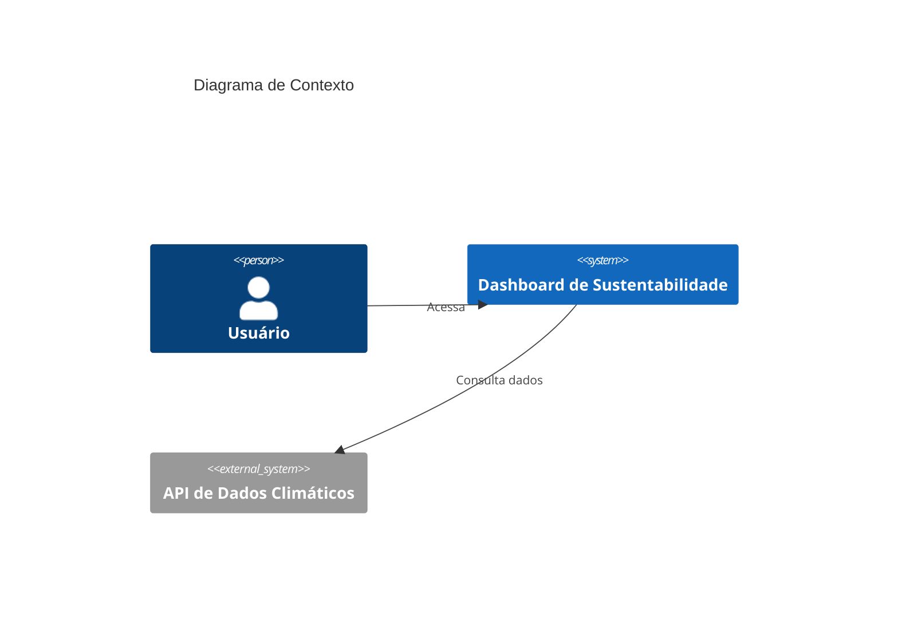
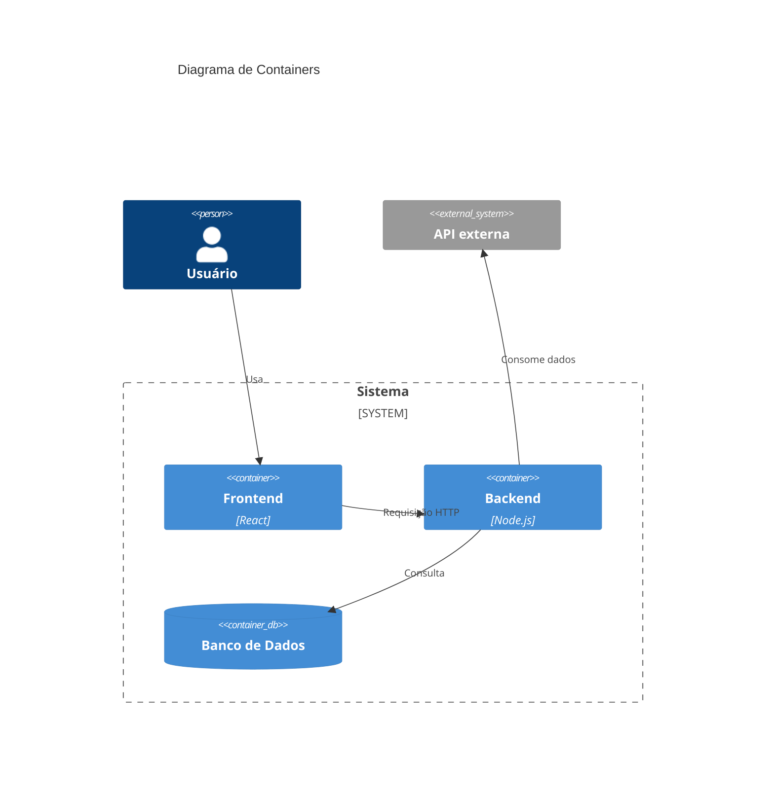

# TP2 - Projeto de Software

**Aluno:** Caio Augusto C. G.  
**Projeto:** Dashboard de Sustentabilidade  
**ODS escolhido:** ODS 13 – Ação contra a mudança global do clima

---

## 1. Objetivo desta etapa

Definir o projeto arquitetural da solução utilizando o modelo C4, apresentando tecnologias, arquitetura e justificativas.

---

## 2. Tecnologias Utilizadas

- Frontend: React  
- Backend: Node.js + Express  
- Banco de Dados: PostgreSQL ou MongoDB  
- Visualização: Chart.js / Recharts  
- Versionamento: Git + GitHub  

---

## 3. Projeto Arquitetural

Arquitetura cliente-servidor com separação em:

- Frontend (interface)
- Backend (lógica e API)
- Banco de dados (persistência)

---

## 4. C4 Model

### 🔹 Context Diagram

---

### 🔹 Container Diagram

---

## 5. Fluxo do Sistema

1. Usuário acessa o sistema  
2. Realiza login  
3. Frontend envia requisição  
4. Backend processa  
5. Dados retornam e são exibidos  

---

## 6. Justificativa da Arquitetura

- Escalabilidade  
- Organização em camadas  
- Facilidade de manutenção  
- Integração com dados externos  

---

## 7. Planejamento TP3

- Criar frontend React  
- Criar backend Node.js  
- Implementar login  
- Criar API  
- Integrar dados  
- Criar gráficos  
