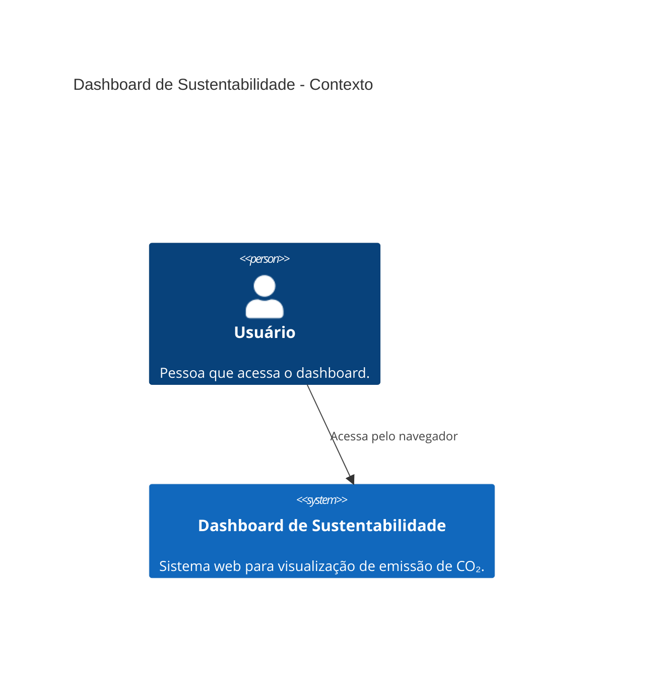
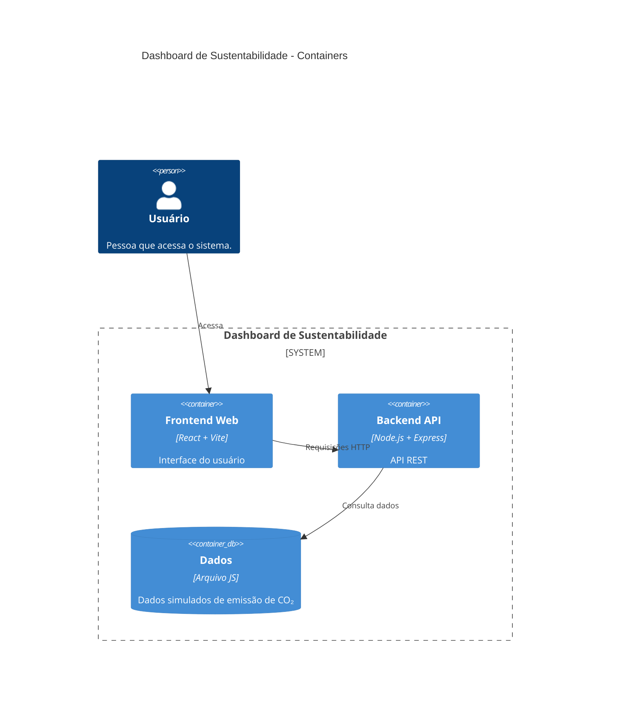

# Arquitetura C4

## Diagrama de Contexto

```mermaid
C4Context
    title Dashboard de Sustentabilidade - Contexto

    Person(usuario, "Usuário", "Pessoa que acessa o dashboard.")
    System(dashboard, "Dashboard de Sustentabilidade", "Sistema web para visualização de emissão de CO₂.")

    Rel(usuario, dashboard, "Acessa pelo navegador")
```

## Diagrama de Containers

```mermaid
C4Container
    title Dashboard de Sustentabilidade - Containers

    Person(usuario, "Usuário", "Pessoa que acessa o sistema.")

    System_Boundary(s1, "Dashboard de Sustentabilidade") {
        Container(frontend, "Frontend Web", "React + Vite", "Interface do usuário")
        Container(backend, "Backend API", "Node.js + Express", "API REST")
        ContainerDb(data, "Dados", "Arquivo JS", "Dados simulados de emissão de CO₂")
    }

    Rel(usuario, frontend, "Acessa")
    Rel(frontend, backend, "Requisições HTTP")
    Rel(backend, data, "Consulta dados")
```

## Justificativa

A arquitetura cliente-servidor separa responsabilidades e facilita manutenção, evolução e testes.
